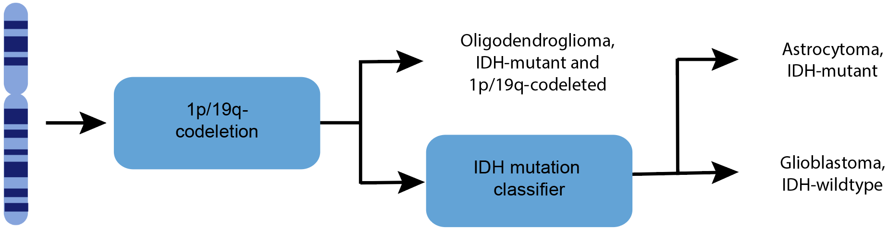
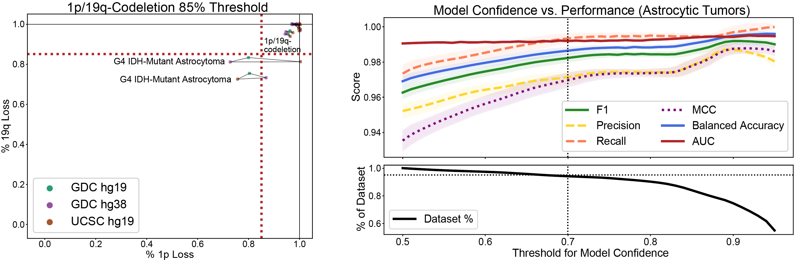
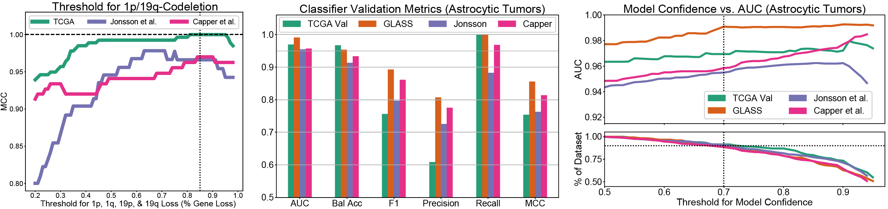
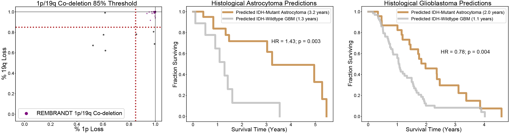

# scna2idh



This repository gives a system that classifies adult diffuse glioma as 1p/19q-codeleted oligodendroglioma, IDH-mutant astrocytoma, or IDH-wildtype glioblastoma using somatic copy number alteration (SCNA) data alone. This system was developed using cross-validation on 786 adult diffuse gliomas in The Cancer Genome Atlas (TCGA)  projects TCGA-LGG and TCGA-GBM, validated using three independant dataset and a holdout portion of the TCGA, and depolyed on subjects in the REMBRANDT study for whom SCNA data, but not IDH mutational status, is available. 

## Useage 

1. The first step is to generate copy number segmentation files. Segmentation files can be derived from a variety of data modalities, including SNP array, DNA methylation array, targeted sequecing, whole genome sequencing, and low-pass whole genome sequecning data. 

2. Given copy number segmenation files, GISTIC 2.0 [[1]](#1) can generate gene-level SCNA calls. The GISTIC 2.0 pameters we used in this study are listed in the forthcoming paper. GenePattern's GISTIC 2.0 [documentation](https://www.genepattern.org/modules/docs/GISTIC_2.0) is a good resource for understanding these parameters and for creating input files for GISITC 2.0. Instructions for GISTIC 2.0 installation can be found [here](http://portals.broadinstitute.org/cgi-bin/cancer/publications/pub_paper.cgi?mode=view&paper_id=216&p=t).

3. A mapping between genes and chromosome arms is necessary for this. The default 

4. Requirements for our predictive system

   - The jupyter-notebook `classification_system_example.ipynb` gives a working example of 1p/19q-codeletion and IDH-mutant prediction for all samples in the TCGA-LGG and TCGA-GBM datasets. 

   - A python file can be run directly from the command line as

     ```bash
     python predict_glioma_subtype.py -s {scna_path} -g {gene_loc_path} -o {outfile}
     ```

     | Name                  | Flag | Description                                                  |
     | --------------------- | ---- | ------------------------------------------------------------ |
     | scna_path             | -s   | Filepath to a csv file whose indices are sample names, columns are genes, and its values are thresholded GISTIC 2.0 scores. |
     | gene_loc_path         | -g   | Filepath to a csv file whose indices are genes. This csv file much have a column labeled "chr_arm" that lists the chromosome arm associated with each gene. |
     | outfile               | -o   | Filepath to which patient predictions, and their prediction confidence, are saved in a .csv format. |
     | threshold (optional)  | -t   | Model only returns predictions whose prediction confidence is above the specified threshold. Default threshold is 0.7. Threshold at or below 0.5 return all predictions. |
     | model_path (optional) | -m   | Path to trained model. Default path is set to latest trained model. |

     The SCNA dataframe must contain genes from all of the following chromosome arms: 1p, 1q, 2p, 2q, 3p, 3q, 4p, 4q, 5p, 5q, 6p, 6q, 7p, 7q, 8p, 8q, 9p, 9q, 10p, 10q, 11p, 11q, 12p, 12q, 13q, 14q, 15q, 16p, 16q, 17p, 17q, 18p, 18q, 19p, 19q, 20p, 20q, 21q, 22q.

     Example

      1. Download Xena TCGA glioma SCNA data

         ```bash
         wget -P ./data/ https://tcga-xena-hub.s3.us-east-1.amazonaws.com/download/TCGA.GBMLGG.sampleMap%2FGistic2_CopyNumber_Gistic2_all_thresholded.by_genes.gz
         ```

     2. Reformat Xena TCGA glioma SCNA data

        ```bash
        python utils/reformat_xena_example_data.py 
        ```

     3. Run

        ```bash
        python predict_glioma_subtype.py -s ./data/Xena_GBMLGG_GISTIC_Scores.csv -g ./data/gistic_cytoband_chr_arm_23109x4.csv -o ./data/tcga_preds.csv 
        ```

     Note: in our study, we used TCGA SCNA data we computed from copy number segmenation files downloaded from the GDC, not data preprocessed GISTIC scores hosted by UCSC's Xena. We use Xena data here for ease. 

## Results

### Cross-validation



Calling 1p/19q-codeletions based a 85% threshold for loss of chromosome arms 1p, 1q, 19p, and 19q our system classifies oligodendrogliomas in all three versions of our TCGA training set (UCSC hg19, GDC hg19, GDC hg38) with 100% accuacy. Our system's second stage--an IDH-mutation classifier trained on adult astrocytic glioma--also performed well  (AUC= 0.990 +/- 0.001, MCC=0.935 +/- 0.006). We calabrated this classifier and rejected samples whose prediction was given with 70% or less confidence. This raised our model's performance (AUC= 0.992 +/- 0.001, MCC = 0.970 +/- 0.004) at the cost of only rejecting 5% of samples.

### Validation on three independent datasets and holdout TCGA validation set



As shown above, an 85% threshold was optimal for the TCGA training set and optimal or nearly optimal for two independent validation sets published by Capper et al. (MCC=0.97) and Jonsson et al. (MCC=0.97), respectively. Our IDH mutation classifier performed well across three independent validation datasets and our holdout TCGA cohort of histological grade 4 patients with surrogate IDH labels not found from IDH sequencing. When evaluated on patients with model confidence greater than 70%, our IDH mutation classifier archived AUC scores greater than 0.95 on each dataset.

### REMBRANDT study predictions



Our REMBRANDT 1p/19q-codeleted oligodendroglioma screen captured the densest area of tumors with significant gene losses on chromosome arms 1p and 19q, consistent with the 1p/19q-codeletion screens on our training and validation sets. Our IDH mutation predictions on histological astrocytomas generated a dramatic survival difference between predicted IDH-wildtype gliomas and IDH-mutant astrocytomas (HR=1.51, p = 0.003), log-rank) and appeared to correctly identify histological lower-grade IDH-wildtype gliomas (OS=1.1 years) now considered to be IDH-wildtype glioblastomas. Histological glioblastomas predicted to be IDH-wildtype glioblastomas have the same median overall survival (1.1 years), and their survival trajectory was significantly worse than those of histological grade 4 tumors that were predicted IDH-mutant astrocytomas (HR=0.78, p=0.004, log-rank).

```
## Citation
If this work useful for you, please cite the following papers:
```

## Citation

If you find this work useful, please cite the following [paper](https://actaneurocomms.biomedcentral.com/articles/10.1186/s40478-021-01295-3) (PMID: 34863298):

````
```
@article{nuechterlein2021machine,
  title={Machine learning modeling of genome-wide copy number alteration signatures reliably predicts IDH mutational status in adult diffuse glioma},
  author={Nuechterlein, Nicholas and Shapiro, Linda G and Holland, Eric C and Cimino, Patrick J},
  journal={Acta Neuropathologica Communications},
  volume={9},
  number={1},
  pages={1--18},
  year={2021},
  publisher={BioMed Central}
}
```
````


## References

<a id="1">[1]</a> Mermel CH, Schumacher SE, Hill B, Meyerson ML, Beroukhim R, Getz G (2011) GISTIC2.0 facilitates sensitive and confident localization of the targets of focal somatic copy-number alteration in human cancers. Genome Biol 12: R41 Doi 10.1186/gb-2011-12-4-r41

